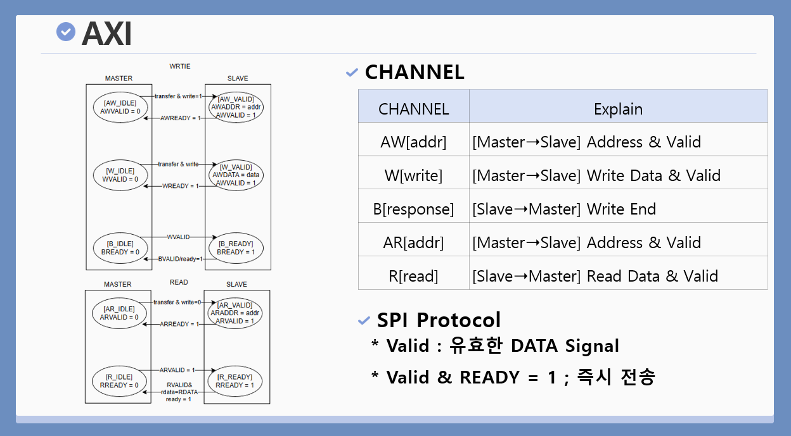

  

 

# 🚀 MicroBlaze AXI4 기반 SPI & I2C 통신 프로토콜 설계 및 UVM 검증

본 프로젝트는 온디바이스 AI 반도체 설계를 위한 **AXI4 기반의 SPI 및 I2C 페리퍼럴(Peripheral) 하드웨어 설계와 UVM(Universal Verification Methodology) 검증 포트폴리오**입니다. 

AMBA AXI4 버스 프로토콜을 활용하여 CPU(Master)와 하위 페리퍼럴(Slave) 간의 통신 아키텍처를 구현하였으며, 하드웨어(RTL) 계층부터 최상위 응용 소프트웨어(Application) 계층까지 4단계의 Layer 구조를 통해 전체 시스템의 제어 및 통신 시나리오를 통합하고 검증하였습니다.

* **개발자:** 전정묵 (대한상공회의소 서울기술교육센터 온디바이스 AI 반도체 설계)
* **설계 및 검증 언어:** SystemVerilog, Verilog HDL, C/C++
* **개발 환경 및 주요 툴:** Linux, Synopsys VCS, Verdi, Vim, Xilinx Vivado

 

## 📑 목차 (Table of Contents)
1. [🏗️ AXI Protocol Architecture](#1-️-axi-protocol-architecture)
2. [⚙️ SPI Protocol Operation](#2-️-spi-protocol-operation)
3. [📚 I2C Protocol & Layer Architecture](#3--i2c-protocol--layer-architecture)
4. [🔄 Operation Scenario (SW Control)](#4--operation-scenario-sw-control)
5. [✅ UVM Verification & Coverage](#5--uvm-verification--coverage)
6. [🛠️ Troubleshooting & Debugging](#6-️-troubleshooting--debugging)

## 1. 🏗️ AXI Protocol Architecture

  
  
<em>Figure 1. AXI Master & Slave Communication Block Diagram</em>

**[시스템 블록도 상세 설명]**
전체 시스템을 제어하는 CPU(MicroBlaze)가 **AXI Master**로 동작하며, 설계된 SPI 및 I2C 통신 IP는 **AXI Slave**로 할당됩니다. 하드웨어와 소프트웨어 간의 데이터 교환은 Memory-Mapped I/O 구조를 채택하였습니다. Master는 시스템에 할당된 Base Address와 IP 내부의 Register Offset을 가산하여 특정 레지스터 공간에 접근하며, 이를 통해 페리퍼럴의 상태(Status)를 모니터링하고 제어 명령(Command)을 인가합니다.

  
  
<em>Figure 2. AXI 5-Channel 구성 및 Handshake 원리</em>

**[AXI 채널 및 핸드셰이크 상세 설명]**
AXI4 프로토콜은 데이터 전송 효율을 높이기 위해 읽기(Read)와 쓰기(Write) 채널이 물리적으로 분리된 5-Channel 구조로 설계되어 있습니다. 데이터 트랜잭션의 신뢰성은 `VALID` 신호(송신측 데이터 인가 완료)와 `READY` 신호(수신측 수신 준비 완료)가 동시에 논리 레벨 `1`을 유지할 때 데이터를 래치(Latch)하는 핸드셰이크(Handshake) 메커니즘을 통해 동기화됩니다.

| Channel (채널) | Direction (방향) | 통신 데이터 및 제어 내용 (Description) |
| :--- | :---: | :--- |
| **AW (Write Address)** | Master ➔ Slave | 쓰기 동작을 수행할 목적지 Address 및 버스트(Burst) 제어 신호 전송 |
| **W (Write Data)** | Master ➔ Slave | 레지스터에 기록할 Write Data 및 바이트 활성화(Strobe) 신호 전송 |
| **B (Write Response)** | Slave ➔ Master | 쓰기 트랜잭션 정상 완료 여부를 알리는 상태 응답 전송 |
| **AR (Read Address)** | Master ➔ Slave | 읽기 동작을 수행할 목적지 Address 및 관련 제어 신호 전송 |
| **R (Read Data)** | Slave ➔ Master | 요청받은 주소에서 추출한 Read Data 및 읽기 상태 응답 신호 전송 |

 

## 2. ⚙️ SPI Protocol Operation

  
  
<em>Figure 3. SPI (Serial Peripheral Interface) 동작 블록도</em>

**[SPI 프로토콜 상세 설명]**
SPI는 고속 동기식(Synchronous) 직렬 통신 프로토콜로, Master와 Slave 간 전이중(Full-Duplex) 방식의 통신을 수행합니다. 
* **SCLK (Serial Clock):** Master가 생성하여 통신 동기를 맞추는 기준 클럭.
* **CS_N (Chip Select):** Active Low 신호로, Master가 통신 대상 Slave를 활성화.
* **MOSI (Master Out Slave In) / MISO (Master In Slave Out):** 양방향 데이터 전송 라인.
내부 상태 머신(FSM)은 클럭 에지에 동기화되어 Shift Register를 제어하며, 데이터를 직렬로 출력 및 수신하는 구조로 설계되었습니다.

 

## 3. 📚 I2C Protocol & Layer Architecture

  
  
<em>Figure 4. I2C (Inter-Integrated Circuit) 통신 프로토콜 개요</em>

**[I2C 물리 계층 상세 설명]**
I2C는 `SCL`(클럭)과 `SDA`(데이터) 2가닥의 라인을 사용하는 반이중(Half-Duplex) 동기식 통신 프로토콜입니다. 
물리 계층은 **Open Drain** 구조로 설계되어 있습니다. 하드웨어 출력 핀이 능동적으로 논리 `1`의 전압을 인가하지 않고 버스를 개방(High-Z) 상태로 전환하며, 외부 회로에 구성된 **Pull-up 저항**을 통해 논리 `1`을 유지합니다. 이는 다중 디바이스 환경에서 발생할 수 있는 전기적 단락(Short Circuit)을 하드웨어적으로 방지합니다.

  
  
<em>Figure 5. 소프트웨어-하드웨어 간 4단계 I2C Layer Architecture</em>

**[Layer Architecture 상세 설명]**
시스템의 이식성과 유지보수성을 확보하기 위해 통신 스택을 4개의 Layer로 논리적 분리 설계를 적용했습니다.

| 계층 (Layer) | 주요 역할 및 기능 (Role & Component) |
| :---: | :--- |
| **Application** | 최상위 응용 소프트웨어 계층. 사용자 입력(Button)을 처리하여 데이터 전송 명령(`Transfer`)을 호출하고, 수신된 스위치(Switch) 상태에 따라 LED를 제어(`GetState`)하는 비즈니스 로직 수행. |
| **Driver** | 디바이스 드라이버 계층. 레지스터 비트 마스킹(Bit Masking) 및 플래그 제어를 통한 구체적인 하드웨어 제어 시퀀스 구현. |
| **HAL** | Hardware Abstraction Layer. 물리적 AXI 버스 주소 맵핑을 통해 하드웨어를 추상화하여 상위 계층에 표준화된 API 제공. |
| **Hardware** | Verilog/SystemVerilog로 설계된 RTL 로직. 직렬/병렬 데이터 변환 및 AXI 트랜잭션 처리를 포함한 물리적 전기 신호 제어. |

 

## 4. 🔄 Operation Scenario (SW Control)

  
  
<em>Figure 6. Master-Slave 간 I2C 동작 시나리오 블록도</em>

**[데이터 흐름 상세 설명]**
Master와 Slave 노드 간 I2C 프로토콜 기반 데이터 트랜잭션 흐름입니다. 
Master 측의 물리적 Button 입력은 카운트 값(Up Count)으로 소프트웨어 처리됩니다. 해당 데이터는 AXI 버스를 통해 Master 하드웨어 레지스터에 기록된 후, I2C `SDA` 라인을 통해 직렬화되어 Slave 측에 수신(Write Operation)됩니다. 이와 독립적으로 Slave 측의 Switch 상태 값은 I2C Read Operation을 통해 Master로 회수되어 LED 출력 제어에 사용됩니다.

  
  
<em>Figure 7. Application Layer의 C Code 기반 상태 감시(Polling) 및 제어 로직</em>

**[소프트웨어 제어 로직 상세 설명]**
C 언어 기반 펌웨어 제어 코드입니다. 마이크로컨트롤러는 `while(1)` 메인 루프를 통해 하드웨어 상태 레지스터를 주기적으로 검사하는 폴링(Polling) 기법을 수행합니다. 비트 연산자(`&`, `|`)를 이용하여 Status Register의 특정 비트(Busy, Done)를 마스킹하여 통신 가능 상태를 검증한 후 제어 명령을 인가합니다. 수신 데이터에 대한 조건 분기(`if-else`)를 통해 GPIO 핀을 제어하는 구조로 설계되었습니다.

 

## 5. ✅ UVM Verification & Coverage

  
  
<em>Figure 8. UVM 기반 검증 시뮬레이션 및 100% Functional Coverage 달성 리포트</em>

**[UVM 검증 환경 및 커버리지 상세 설명]**
Synopsys VCS 및 Verdi를 활용하여 UVM(Universal Verification Methodology) 기반 검증 환경을 구축했습니다.
SystemVerilog의 무작위화(`randomize`) 기법을 사용하여 `0x00`~`0xFF` 범위의 난수 데이터 페이로드를 생성하고, `Sequencer ➔ Driver ➔ DUT ➔ Monitor ➔ Scoreboard` 구조를 통해 송수신 무결성을 자동 검증했습니다. Coverage 모델링을 통해 전체 데이터 범위를 분할(Bins)하고 `0x00`, `0xFF`, `0x55`, `0xAA` 등 비트 반전 코너 케이스(Corner Case)를 포함하여 Functional Coverage 100%를 달성했습니다.

 

## 6. 🛠️ Troubleshooting & Debugging

하드웨어(RTL)와 소프트웨어(C Code), 그리고 검증 환경(UVM)을 통합하는 과정에서 발생한 두 가지 주요 타이밍 결함을 식별하고 정석적인 하드웨어 설계 기법으로 디버깅하였습니다.

### Issue 1. Done Signal Timing Mismatch

  
  
<em>Figure 9. 하드웨어 Done Signal과 소프트웨어 Polling 주기 간의 타이밍 동기화 디버깅 파형</em>

* **문제 현상:** 하드웨어 통신 완료 시 발생하는 `done` 신호를 CPU 소프트웨어가 감지하지 못하여 시스템이 무한 대기 상태에 진입함.
* **원인 분석:** RTL 설계에서 `done` 신호는 단 1 시스템 클럭 사이클(`1 Tick`) 동안만 활성화되나, 소프트웨어가 AXI 버스를 통해 레지스터를 폴링하는 주기는 수십 클럭 사이클 이상 소요되므로 해당 신호를 물리적으로 캡처하지 못함.
* **해결 방안:** 하드웨어 FSM에 별도의 플립플롭(Flip-Flop) 래치(Latch) 로직을 추가하여, 소프트웨어가 해당 상태 레지스터를 명시적으로 읽어 초기화할 때까지 통신 완료 플래그가 유지되도록 핸드셰이크 타이밍을 재설계함.

### Issue 2. Double Triggering & Race Condition (이중 트리거링 방지)

  
  
<em>Figure 10. UVM Driver와 AXI 통신 간의 이중 트리거링(Race Condition) 방지 펄스 구동 파형</em>

* **문제 현상:** 통신 명령이 연속으로 하달될 때, 페이로드 데이터가 간헐적으로 무시되거나 주소 프레임이 중복 전송되는 현상 발생.
* **원인 분석:** 하드웨어가 1바이트 전송을 완료하고 대기 상태(`WAIT_CMD`)로 복귀한 시점부터 UVM Driver가 AXI 버스를 통해 명령어 레지스터를 `0x00`으로 클리어하기까지 버스 지연 시간(Latency)이 존재함. 이 지연 시간 동안 하드웨어 FSM이 명령어 레지스터에 남은 값을 이전 명령과 동일한 새 명령으로 오인하여 **이중 실행(Double Triggering)**을 수행함.
* **해결 방안:** UVM Driver의 `execute_cmd` 태스크 내부에서 명령어를 인가(`axi_write`)한 즉시 응답을 기다리지 않고 연속하여 `0x00`을 덮어쓰는 **명령어 펄스(Pulse) 구동 방식**을 적용함. 이를 통해 하드웨어가 대기 상태로 복귀했을 때 레지스터가 이미 초기화되어 있도록 구성하여 경합 조건(Race Condition)을 원천 차단함.